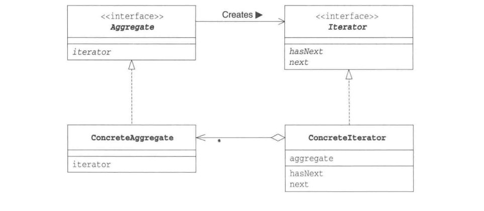
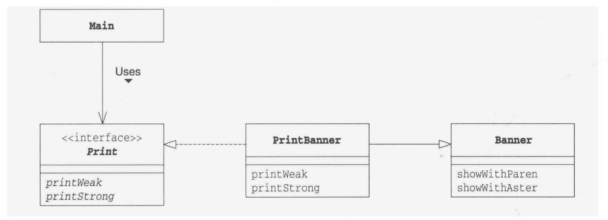
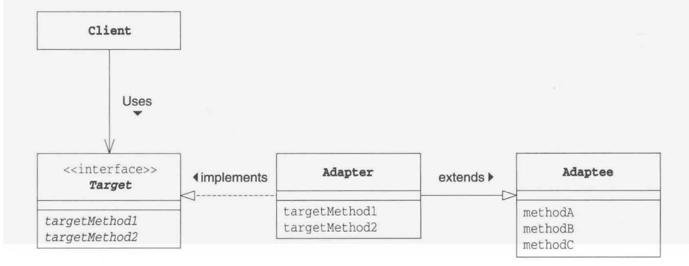
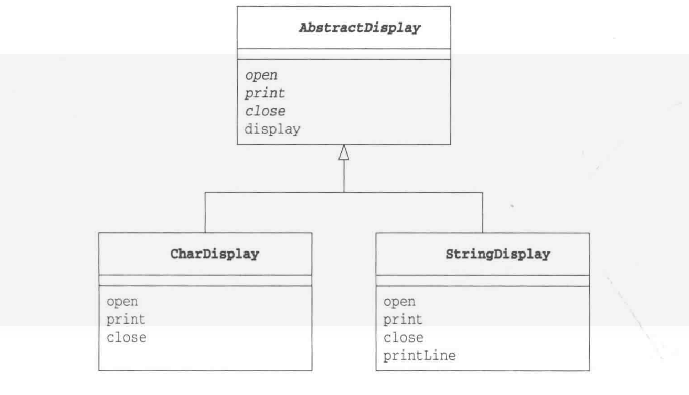
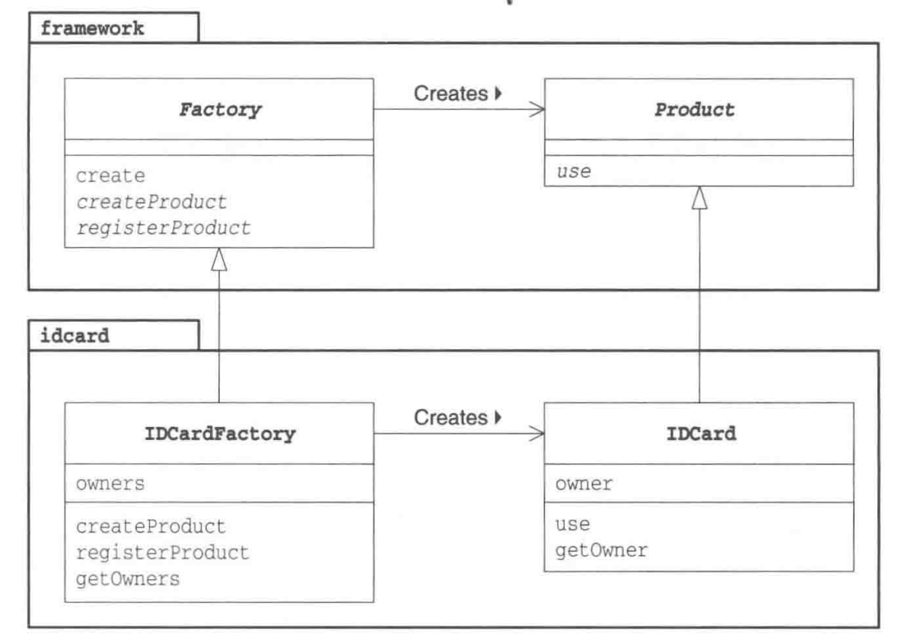
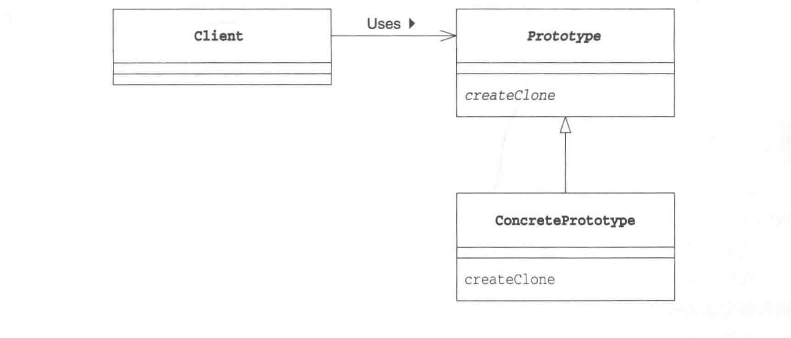
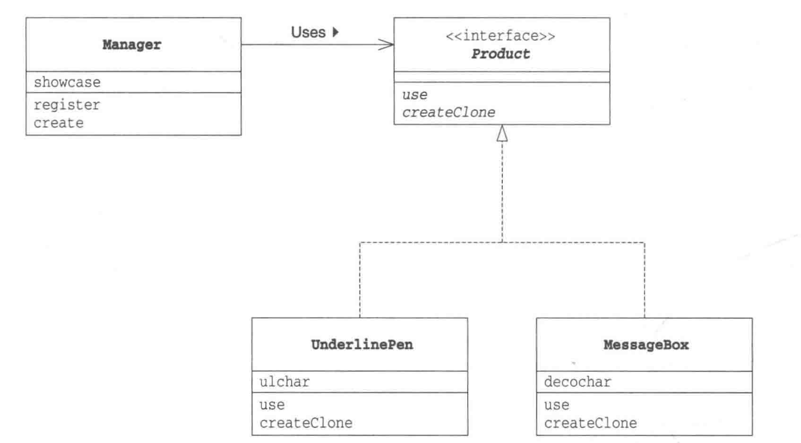
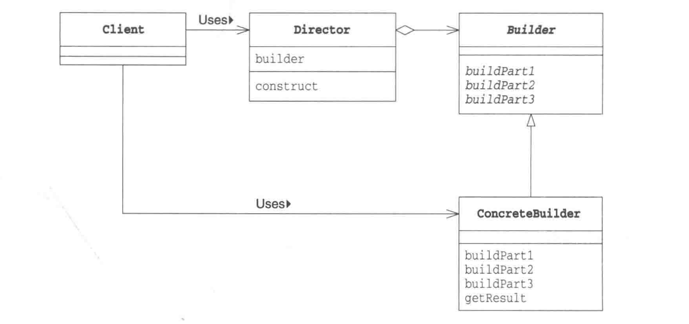

# Gof
学习23中设计模式

> 目前项目结构如下

```
└── kys
    └── Gof
        ├── adapter
        │   ├── AdapterAbstactImpShowItem.java
        │   ├── AdapterAbstractClass.java
        │   ├── AdapterImterface.java
        │   ├── AdapterInterfaceImpShopItem.java
        │   ├── Main.java
        │   └── ShowItem.java
        ├── bridge
        │   ├── Abstraction.java
        │   ├── CountAbstraction.java
        │   ├── DubboAbstraction.java
        │   ├── Implementor.java
        │   ├── Main.java
        │   └── StringImplementor.java
        ├── builder
        │   ├── Builer.java
        │   ├── Director.java
        │   ├── HtmlBuiler.java
        │   ├── Main.java
        │   └── TextBuilder.java
        ├── FactoryMethod
        │   ├── BookFactory.java
        │   ├── BookProduct.java
        │   ├── Factory.java
        │   ├── IDcard.java
        │   ├── Main.java
        │   └── Product.java
        ├── iterator
        │   ├── Aggergate.java
        │   ├── BookIterator.java
        │   ├── Book.java
        │   ├── BookSelf.java
        │   ├── Iterator.java
        │   └── Main.java
        ├── prototype
        │   ├── Main.java
        │   ├── MessageBox.java
        │   ├── Message.java
        │   ├── Product.java
        │   └── UnderLinerBox.java
        ├── singleton
        │   ├── Item.java
        │   └── Singleton.java
        ├── strategy
        │   ├── Hand.java
        │   ├── Main.java
        │   ├── PlayerContext.java
        │   ├── ProbStrategy.java
        │   ├── SimpleStrategy.java
        │   └── Strategy.java
        └── templateMethod
            ├── AbstractDisplay.java
            ├── CharDisplay.java
            ├── Main.java
            └── StringDisplay.java

```

> 所包含的设计模式相关介绍文档如下：

### 迭代器模式

这个设计模式个人在感觉上是非常常用的一种设计模式，通过将数据的遍历过程和业务逻辑结构，可以在遍历过程中分解出一些共用的遍历方法，提高效率。

> 反思：目前的感觉迭代器模式的核心思想就是将数据的遍历和处理和调用过程接偶，其原因是遍历过程具有一定的通用性，通过解耦可以更加方便的降低代码的重复率。重要的思想还有数据的桥接方法，使用继承方式还是使用数据引用传递的方式，通过这种思想将业务独立的itertor和真实的业务数据book组合起来

### 迭代器模式类图


- aggregate：这个接口的作用是生成迭代器，也就是说数据的集成类需要集成和实现这个接口，从而可以产生自己的迭代器

- iterator：这个接口就是迭代器的接口类，定义了一组迭代器通用的方法

- concreteAggregate：这个为aggregate接口的实现类（实际使用中一般把数据的集合类作为这个类的实现）

- concreteIterator：这个类就是迭代器的实现类，这个类需要针对元素类（就是迭代出来的元素）有针对性的思考要怎么设计


###  迭代器例子

> book 迭代的元素

```java
package org.kys.Gaf.iterator;
public class Book {
    private String bookname;
    public Book(String name) {
        this.bookname = name;
    }
    public String getBookname() {
        return bookname;
    }
    public void setBookname(String bookname) {
        this.bookname = bookname;
    }
}
```

> Aggergate接口

```java
package org.kys.Gaf.iterator;

public interface Aggergate<T> {
    Iterator<T> iterator();
}
```

> concretaAggregate-Aggergate接口的实现类 这里使用bookself作为创建迭代器的实现类

```java
package org.kys.Gaf.iterator;
public class BookSelf implements Aggergate<Book>{
    private Book[] books;
    private int bookPosition=0;
    public BookSelf(int bookLength){
        this.books = new Book[bookLength];
    }
    public boolean addBook(Book book){
        if (bookPosition>=books.length){
            return false;
        }
        this.books[bookPosition++]=book;
        return true;
    }

    public Book getBook(int position){
        return books[position];
    }

    public int getBookNumber(){
        return bookPosition;
    }
    @Override
    public Iterator<Book> iterator() {
        return new BookIterator(this);
    }
}
```


> iterator接口 

```java
package org.kys.Gaf.iterator;

public interface Iterator<T> {
    boolean hasNext();
    T next();
}
```

> iterator实现类

```java
package org.kys.Gaf.iterator;
public class BookIterator implements Iterator<Book> {
    private BookSelf bookSelf = null;
    private int bookSelfPosiont = 0;
    public BookIterator(BookSelf bookSelf) {
        this.bookSelf = bookSelf;
    }
    @Override
    public boolean hasNext() {
        if (bookSelfPosiont >= bookSelf.getBookNumber()) {
            return false;
        }else{
            return true;
        }
    }
    @Override
    public Book next() {
        return bookSelf.getBook(bookSelfPosiont++);
    }
}
```

> 主函数 Main

```java
package org.kys.Gaf.iterator;

public class Main {
    public static void main(String[] args) {
        BookSelf bookSelf = new BookSelf(3);
        bookSelf.addBook(new Book("海底两万里"));
        bookSelf.addBook(new Book("堂吉诃德"));
        bookSelf.addBook(new Book("飘"));
        Iterator<Book> iterator = bookSelf.iterator();
        while(iterator.hasNext()){
            System.out.println(iterator.next().getBookname());
        }
    }
}
```
### 迭代器模式

这个设计模式个人在感觉上是非常常用的一种设计模式，通过将数据的遍历过程和业务逻辑结构，可以在遍历过程中分解出一些共用的遍历方法，提高效率。

> 反思：目前的感觉迭代器模式的核心思想就是将数据的遍历和处理和调用过程接偶，其原因是遍历过程具有一定的通用性，通过解耦可以更加方便的降低代码的重复率。重要的思想还有数据的桥接方法，使用继承方式还是使用数据引用传递的方式，通过这种思想将业务独立的itertor和真实的业务数据book组合起来

### 迭代器模式类图



- aggregate：这个接口的作用是生成迭代器，也就是说数据的集成类需要集成和实现这个接口，从而可以产生自己的迭代器

- iterator：这个接口就是迭代器的接口类，定义了一组迭代器通用的方法

- concreteAggregate：这个为aggregate接口的实现类（实际使用中一般把数据的集合类作为这个类的实现）

- concreteIterator：这个类就是迭代器的实现类，这个类需要针对元素类（就是迭代出来的元素）有针对性的思考要怎么设计


###  迭代器例子

> book 迭代的元素

```java
package org.kys.Gaf.iterator;
public class Book {
    private String bookname;
    public Book(String name) {
        this.bookname = name;
    }
    public String getBookname() {
        return bookname;
    }
    public void setBookname(String bookname) {
        this.bookname = bookname;
    }
}
```

> Aggergate接口

```java
package org.kys.Gaf.iterator;

public interface Aggergate<T> {
    Iterator<T> iterator();
}
```

> concretaAggregate-Aggergate接口的实现类 这里使用bookself作为创建迭代器的实现类

```java
package org.kys.Gaf.iterator;
public class BookSelf implements Aggergate<Book>{
    private Book[] books;
    private int bookPosition=0;
    public BookSelf(int bookLength){
        this.books = new Book[bookLength];
    }
    public boolean addBook(Book book){
        if (bookPosition>=books.length){
            return false;
        }
        this.books[bookPosition++]=book;
        return true;
    }

    public Book getBook(int position){
        return books[position];
    }

    public int getBookNumber(){
        return bookPosition;
    }
    @Override
    public Iterator<Book> iterator() {
        return new BookIterator(this);
    }
}
```


> iterator接口 

```java
package org.kys.Gaf.iterator;

public interface Iterator<T> {
    boolean hasNext();
    T next();
}
```

> iterator实现类

```java
package org.kys.Gaf.iterator;
public class BookIterator implements Iterator<Book> {
    private BookSelf bookSelf = null;
    private int bookSelfPosiont = 0;
    public BookIterator(BookSelf bookSelf) {
        this.bookSelf = bookSelf;
    }
    @Override
    public boolean hasNext() {
        if (bookSelfPosiont >= bookSelf.getBookNumber()) {
            return false;
        }else{
            return true;
        }
    }
    @Override
    public Book next() {
        return bookSelf.getBook(bookSelfPosiont++);
    }
}
```

> 主函数 Main

```java
package org.kys.Gaf.iterator;

public class Main {
    public static void main(String[] args) {
        BookSelf bookSelf = new BookSelf(3);
        bookSelf.addBook(new Book("海底两万里"));
        bookSelf.addBook(new Book("堂吉诃德"));
        bookSelf.addBook(new Book("飘"));
        Iterator<Book> iterator = bookSelf.iterator();
        while(iterator.hasNext()){
            System.out.println(iterator.next().getBookname());
        }
    }
}
```

> 思路： 其实大体上和迭代器原本的思想相同，但是在这个地方使用将bookshef（book元素的实现类）作为aggergate的实现类，在调用的时候将通过本身生成迭代器，然后进行迭代功能的实现，我觉得这里才是迭代器真正的难点和实现痛点-集合和迭代器的通信。


> 反思：目前的感觉迭代器模式的核心思想就是将数据的遍历和处理和调用过程接偶，其原因是遍历过程具有一定的通用性，通过解耦可以更加方便的降低代码的重复率。重要的思想还有数据的桥接方法，使用继承方式还是使用数据引用传递的方式，通过这种思想将业务独立的itertor和真实的业务数据book组合起来


    }
}
```

> 思路： 其实大体上和迭代器原本的思想相同，但是在这个地方使用将bookshef（book元素的实现类）作为aggergate的实现类，在调用的时候将通过本身生成迭代器，然后进行迭代功能的实现，我觉得这里才是迭代器真正的难点和实现痛点-集合和迭代器的通信。


> 反思：目前的感觉迭代器模式的核心思想就是将数据的遍历和处理和调用过程接偶，其原因是遍历过程具有一定的通用性，通过解耦可以更加方便的降低代码的重复率。重要的思想还有数据的桥接方法，使用继承方式还是使用数据引用传递的方式，通过这种思想将业务独立的itertor和真实的业务数据book组合起来

### 适配器模式

这个模式个人的感觉是解决了代码特殊部分和通用部分差异性的问题，在处理逻辑中有一部分存在相同的地方但是有部分地方不同的时候可以使用这个方法将相关的不同点进行进一步的适配从而实现代码的复用。

### 适配器模式类图

适配器模式在GAF书中定义了两种

1. 使用引用的方式进行构建



2. 使用继承的方式进行构建



> 注意： 使用接口和使用抽象类的原因是因为java只能支持单继承，如果业务数据和逻辑操作之间的数据交互使用的集成方法而不是使用引用的方式的时候，将有局限性

### 适配器模式例子

#### 接口和抽象类

1. 使用接口方式进行构建

```java
package org.kys.Gaf.adapter;
public interface AdapterImterface {
    public String show(String s);
}
```

2. 使用抽象类实现

```java
package org.kys.Gaf.adapter;

public abstract class AdapterAbstractClass {
    public abstract String show(String s);
}
```

### 实现类

1. 接口的实现类，使用集成进行数据桥接

```java
package org.kys.Gaf.adapter;

public class AdapterInterfaceImpShopItem extends ShowItem implements AdapterImterface {
    @Override
    public String show(String s) {
        return "*"+this.showItem(s)+"*";
    }
}

```


2. 抽象类的实现类，使用引用进行数据桥接

```java
package org.kys.Gaf.adapter;

public class AdapterAbstactImpShowItem extends AdapterAbstractClass{

    private ShowItem showItem;

    public AdapterAbstactImpShowItem(ShowItem showItem){
        this.showItem = showItem;
    }

    @Override
    public String show(String s) {
        return "&&"+this.showItem.showItem(s)+"&&";
    }
}
```

#### 桥接数据

```java
package org.kys.Gaf.adapter;
public class ShowItem {
    public String showItem(String s){
        return "{"+s+"}";
    }
}
```

#### mian 实现类


```java
package org.kys.Gaf.adapter;
public class Main {
    public static void main(String[] args) {
        ShowItem showItem = new ShowItem();
        AdapterImterface adapterImterface = new AdapterInterfaceImpShopItem();
        AdapterAbstractClass adapterAbstractClass = new AdapterAbstactImpShowItem(showItem);
        System.out.println(adapterImterface.show("123123"));
        System.out.println(adapterAbstractClass.show("123123"));
    }
}
```

> 总结反思：针对之前的迭代器模式，我觉得这个模式处理文章开头说的东西，还有一个重要的思想就是使用继承还是使用数据引用。

### 模板方法模式

这个设计模式个人的感觉，其实实现了一个标准化的流程，实现类是实现标准的类，而流程由一开始的抽先类或者接口定义了，是标准的继承用法

### 模板方法模式类图



### 模板方法例子

#### 使用抽象类的模板

```java
package org.kys.Gaf.templateMethod;

/**
 * 模板
 */
public abstract class AbstractDisplay {
    private int speed=5;
    public abstract void start();
    public abstract void stop();
    public abstract void print();

    public int getSpeed() {
        return speed;
    }

    public void setSpeed(int speed) {
        this.speed = speed;
    }

    public void display(){
        start();
        for(int a=0;a<this.speed;a++){
            this.print();
        }
        this.stop();
    }
}
```

#### 抽象类的实现类

1. char 实现类

```java
package org.kys.Gaf.templateMethod;

public class CharDisplay extends AbstractDisplay{

    private char itemChar;
    public CharDisplay(char itemChar){
        this.itemChar=itemChar;
    }

    public CharDisplay(int speed,char itemChar){
        this.setSpeed(speed);
        this.itemChar=itemChar;
    }

    @Override
    public void start() {
        System.out.print("<<");
    }

    @Override
    public void stop() {
        System.out.println(">>");
    }

    @Override
    public void print() {
        System.out.print(this.itemChar);
    }
}
```

2. string 实现类

```java
package org.kys.Gaf.templateMethod;

public class StringDisplay extends AbstractDisplay{

    private String string_name;

    public StringDisplay(String s){
        this.string_name = s;
    }

    public StringDisplay(String s,int speed){
        this.setSpeed(speed);
        this.string_name=s;
    }

    @Override
    public void start() {
        printLine();
    }

    @Override
    public void stop() {
        printLine();
    }

    private void printLine(){
        System.out.print("+");
        for (int a=0;a<this.string_name.length();a++){
            System.out.print("-");
        }
        System.out.println("+");
    }

    @Override
    public void print() {
        System.out.println("|"+this.string_name+"|");
    }
}
```

#### main 函数

```java
package org.kys.Gaf.templateMethod;

public class Main {
    public static void main(String[] args) {
        AbstractDisplay display1 =new CharDisplay('A');
        AbstractDisplay display2 = new StringDisplay("template");
        AbstractDisplay display3 = new StringDisplay("GAF_TEMPLATE");
        display1.display();
        display2.display();
        display3.display();
    }
}
```

### 工厂方法模式

这个模式之前的时候感觉比较困难，现在感觉这个模式同样是比较简单的，要注意一下的几个思想。
1. 工厂方法模式一开始的时候是将工厂接口和工厂生产的产品同时定义出来的。
2. 工厂生产的东西需要传入指定的数据才能生产出来比如下面例子中定义的IDcard类

> 扩展思路> 其实感觉这个模式其实可以和模板方法模式结合使用，在构建产品的过程中使用模板方法模式可以进一步的解耦和优化流程。

### 工厂方法模式的类图



从类图中可以看出项目中工厂和产品之间的关系

### 工厂方法模式例子

#### 接口

1. 工厂接口

```java
package org.kys.Gaf.FactoryMethod;
public interface Factory{
     Product create(IDcard iDcard);
}
```

2. 产品接口

```java
package org.kys.Gaf.FactoryMethod;
public interface Product {
    void use();
}
```

#### 接口的实现类

1. 工厂的实现类

```java
package org.kys.Gaf.FactoryMethod;

public class BookProduct implements Product{
    IDcard iDcard;
    public BookProduct(IDcard iDcard){
        this.iDcard=iDcard;
    }
    @Override
    public void use() {
        System.out.println(iDcard.getName()+"正在使用：\""+iDcard.getCardName()+"\"ID 卡");
    }
}
```

2. 商品的实现类

```java
package org.kys.Gaf.FactoryMethod;

public class BookProduct implements Product{
    IDcard iDcard;
    public BookProduct(IDcard iDcard){
        this.iDcard=iDcard;
    }
    @Override
    public void use() {
        System.out.println(iDcard.getName()+"正在使用：\""+iDcard.getCardName()+"\"ID 卡");
    }
}
```

#### 信息载体

```java
package org.kys.Gaf.FactoryMethod;

public class IDcard {
    private String cardName;
    private String name;

    public IDcard(String cardName,String name){
        this.cardName=cardName;
        this.name=name;
        System.out.println("创建了"+this.getName()+"的"+this.getCardName()+"卡片");
    }

    public String getCardName() {
        return cardName;
    }

    public void setCardName(String cardName) {
        this.cardName = cardName;
    }

    public String getName() {
        return name;
    }

    public void setName(String name) {
        this.name = name;
    }
}
```

#### 运行主函数

```java
package org.kys.Gaf.FactoryMethod;

public class Main {
    public static void main(String[] args) {
        Factory factory = new BookFactory();
        Product product1= factory.create(new IDcard("美容卡","tom"));
        Product product2= factory.create(new IDcard("购物卡","jack"));
        product1.use();
        product2.use();
    }
}
```
### 单例模式

这个模式其实并不需要过多的阐释，重点是如何构建好一个单例模式，最基础的代码如下

```java
package org.kys.Gaf.singleton;
public class Singleton {
    private static final Singleton = new Singleton();
    private Singleton() {}
    public static getSignleton(){
        return singleton;
    }
}
```

以上的方法属于饿汉模式：一开始就生成的实例

其实单例模式还有一种懒加载模式-饿汉模式，不过这种模式有许多的坑

### 懒加载单例模式最基础样式

```java
package org.kys.Gaf.singleton;
public class Singleton {
    private static Singleton singleton = null;
    private Singleton(){}
    public static Singleton getSingleton() {
        if(singleton == null) singleton = new Singleton();
        return singleton;
    }
}
```

> 这种写法有线程安全问题，比如1线程运行到if语句中2线程也运行到if中，之后将会创建两个对象造成对象不同。

### 添加线程安全的单例模式

1. 基本思路 synchronized解决

```java
package org.kys.Gaf.singleton;

public class Singleton {
    private static Singleton singleton = null;

    private Singleton() {
    }

    public static synchronized Singleton getSingleton() {
        if (singleton == null) singleton = new Singleton();
        return singleton;
    }
}
```

> 缺点性能低下 synchronized 99% 不需要线程同步

2. synchronized代码块优化

```java
package org.kys.Gaf.singleton;

public class Singleton {
    private static Singleton singleton = null;

    private Singleton() {
    }

    public static Singleton getSingleton() {
        synchronized(Singleton.class) {
            if (singleton == null) singleton = new Singleton();
        }
        return singleton;
    }
}
```

> 没有使用全局锁但是还是有问题，代码块同样需要每次运行

3. 双重锁家线程可见

```java
package org.kys.Gaf.singleton;

public class Singleton {
    private volatile static Singleton singleton = null;

    private Singleton() {
    }

    public static Singleton getSingleton() {
        if (singleton == null) {
            synchronized (Singleton.class) {
                if (singleton == null) singleton = new Singleton();
            }
        }
        return singleton;
    }
}
```

这里使用两个if 来解决99%情况下不需要对if进行线程隔离的情况，使用volatile是为了防止指令重拍续导致的问题，分析如下：

```java
public class test{
public static Singleton getSingleton() {
        if (instance == null) {                         //Single Checked
            synchronized (Singleton.class) {
                if (instance == null) {                 //Double Checked
                    instance = new Singleton();
                }
            }
        }
        return instance ;
    }
}
```

这段代码看起来很完美，很可惜，它是有问题。主要在于instance = new Singleton()这句，这并非是一个原子操作，事实上在 JVM 中这句话大概做了下面 3 件事情。

1. 给 instance 分配内存
2. 调用 Singleton 的构造函数来初始化成员变量
3. 将instance对象指向分配的内存空间（执行完这步 instance 就为非 null 了）

但是在 JVM 的即时编译器中存在指令重排序的优化。也就是说上面的第二步和第三步的顺序是不能保证的，最终的执行顺序可能是 1-2-3 也可能是 1-3-2。如果是后者，则在 3 执行完毕、2 未执行之前，被线程二抢占了，这时 instance 已经是非 null 了（但却没有初始化），所以线程二会直接返回 instance，然后使用，然后顺理成章地报错。

### 使用内部静态类

```java
public class Singleton {  
    private static class SingletonHolder {  
        private static final Singleton INSTANCE = new Singleton();  
    }  
    private Singleton (){}  
    public static final Singleton getInstance() {  
        return SingletonHolder.INSTANCE; 
    }  
}
```

这种写法仍然使用JVM本身机制保证了线程安全问题；由于 SingletonHolder 是私有的，除了 getInstance() 之外没有办法访问它，因此它是懒汉式的；同时读取实例的时候不会进行同步，没有性能缺陷；也不依赖 JDK 版本。

### 枚举 Enum

用枚举写单例实在太简单了！这也是它最大的优点。下面这段代码就是声明枚举实例的通常做法。
```java
public enum EasySingleton{
    INSTANCE;
}
```

我们可以通过EasySingleton.INSTANCE来访问实例，这比调用getInstance()方法简单多了。创建枚举默认就是线程安全的，所以不需要担心double checked locking，而且还能防止反序列化导致重新创建新的对象。但是还是很少看到有人这样写，可能是因为不太熟悉吧。

### 总结
一般来说，单例模式有五种写法：懒汉、饿汉、双重检验锁、静态内部类、枚举。上述所说都是线程安全的实现，文章开头给出的第一种方法不算正确的写法。


### 原型模式

原型模式其实本质上解决了如下的两个问题：
- 类名称和类的绑定，无法实现动态的（通过字符串或者名称很方便的）生成想要生成的相关累的实例。
- 一个统一的入口将相同种类（实现同一个借口或者继承自相同的类的类）进行统一的管理

> 自我引申： 感觉这个模式，相当于商品的买卖，而圆形模式中的字符串就相当于需要金钱（一种通用的可共识的东西），而产出的类，就相当于商品

### 原型模式类图



根据上面所说的我的理解可以这么类比

- client 相当于用户
- users 的过程相当于付款
- prototype的createClone 相当于取货的过程
- 最后 concretePrototype（prototype） 就是商品

通过这样的分析，其实理论上createClone和prototype应该是要解耦的但是，因为java中clone只能自调用所以采用这种方法，其实可以在分装一层调用层，不过这样就增加了复杂度了，这里就不多说了。

方便理解；下面是程序的类图



### 原型模式例子

#### client 的实现

```java
package org.kys.Gaf.prototype;

import java.util.HashMap;

public class Message {
    private HashMap<String,Product> showcase =
            new HashMap<>();
    public void register(String name,Product o){
        showcase.put(name,o);
    }
    public Product create(String name){
        return showcase.get(name).createClone();
    }
}
```

#### 商品接口的实现

```java
package org.kys.Gaf.prototype;

public interface Product extends Cloneable{
    void use(String message);
    Product createClone();
}
```

#### 商品接口的实现类

```java
package org.kys.Gaf.prototype;

public class MessageBox implements Product {

    private char segmentation;

    public MessageBox(char segmentation) {
        this.segmentation = segmentation;
    }

    @Override
    public void use(String message) {
        printLine(message.length());
        System.out.println(this.segmentation + message + this.segmentation);
        printLine(message.length());
    }

    private void printLine(int length) {
        for (int a = 0; a < length + 2; a++) {
            System.out.print(this.segmentation);
        }
        System.out.println();
    }

    @Override
    public Product createClone() {
        try {
            return (Product) this.clone();
        } catch (CloneNotSupportedException e) {
            e.printStackTrace();
            return null;
        }
    }
}
```

```java
package org.kys.Gaf.prototype;

public class UnderLinerBox implements Product{

    private char segmentation;

    public UnderLinerBox(char segmentation){
        this.segmentation=segmentation;
    }

    @Override
    public void use(String message) {
        System.out.println(this.segmentation+message+this.segmentation);
        printLine(message.length());
    }

    private void printLine(int length) {
        for (int a = 0; a < length + 2; a++) {
            System.out.print(this.segmentation);
        }
        System.out.println();
    }

    @Override
    public Product createClone() {
        try {
            return (Product) this.clone();
        } catch (CloneNotSupportedException e) {
            e.printStackTrace();
            return null;
        }
    }
}
```

#### 主函数

```java
package org.kys.Gaf.prototype;

public class Main {
    public static void main(String[] args) {
        Message message = new Message();
        Product box1 = new MessageBox('~');
        Product box2 = new MessageBox('*');
        Product box3 = new UnderLinerBox('-');

        message.register("~",box1);
        message.register("*",box2);
        message.register("-",box3);

        Product boxx1 = message.create("~");
        Product boxx2 = message.create("*");
        Product boxx3 = message.create("-");

        System.out.println(box1+" "+boxx1);
        System.out.println(box2+" "+boxx2);
        System.out.println(box3+" "+boxx3);

        boxx1.use("hello world");
        boxx2.use("hello world");
        boxx3.use("hello world");
    }
}
```

### 建造者模式

这个模式在我的个人感觉中感觉就像是升级版的模板方法模式，这个模式中的director起到了监控和调用各种builer类的方法（感觉相当于在），然后在director中编写对应的流程函数（construction）来调用指定的相关的各种函数。和模板方法中使用hashmap进行字符串到具体clone 的对应关系相同，在建造者模式中我也使用了HashMap进行获取对象的解耦，实现了统一入口

> 引申: 其实在director中指定相关的函数并不是一个很好的方法，其实可以实现一个模板接口，通过这个接口动态的实现相关的策略，以后再想想。

### 建造者模式类图



### 建造者模式实例

#### Director

```java
package org.kys.Gaf.builder;

import java.util.HashMap;

public class Director {
    private HashMap<String,Builer> map = new HashMap<>();
    public Director(String name,Builer builer){
        map.put(name,builer);
    }
    public Director(){
        super();
    }
    public boolean setBuiler(String name,Builer builer){
        if(builer==null){
            return false;
        }
        map.put(name,builer);
        return true;
    }
    public void construction(String name){
        Builer builer = map.get(name);
        //build 只能按照输入进行运作，无法窥视到内部实现
        builer.makeTitile("----------");
        builer.makeItem("builer item");
        builer.makeEndoFText("----------");
    }
}
```

#### builer接口

```java
package org.kys.Gaf.builder;

public abstract class Builer<T> {
    public abstract void makeTitile(String title);
    public abstract void makeItem(String item);
    public abstract void makeEndoFText(String end);
    public abstract T getResult();
}
```

#### builer 实现类

```java
package org.kys.Gaf.builder;

public class HtmlBuiler extends Builer{

    StringBuffer stringBuffer = new StringBuffer();

    @Override
    public void makeTitile(String title) {
        stringBuffer.append("<p>"+title+"</p>\n");
    }

    @Override
    public void makeItem(String item) {
        stringBuffer.append("<p>"+item+"</p>\n");
    }

    @Override
    public void makeEndoFText(String end) {
        stringBuffer.append("<p>"+end+"</p>\n");
    }

    @Override
    public String getResult() {
        return stringBuffer.toString();
    }
}
```

```java
package org.kys.Gaf.builder;

//范型在定义的时候使用
public class TextBuilder extends Builer{

    StringBuffer stringBuffer = new StringBuffer();

    @Override
    public void makeTitile(String title) {
        stringBuffer.append(title+"\n");
    }

    @Override
    public void makeItem(String item) {
        stringBuffer.append(item+"\n");
    }

    @Override
    public void makeEndoFText(String end) {
        stringBuffer.append(end+"\n");
    }

    @Override
    public String getResult(){
        return stringBuffer.toString();
    }
}
```

#### client 或者主函数

```java
package org.kys.Gaf.builder;

public class Main {
    public static void main(String[] args) {
        Builer textBuiler = new TextBuilder();
        Builer htmlBuiler = new HtmlBuiler();
        Director director = new Director();
        director.setBuiler("text",textBuiler);
        director.setBuiler("html",htmlBuiler);

        director.construction("text");
        director.construction("html");

        System.out.println(textBuiler.getResult());
        System.out.println(htmlBuiler.getResult());
    }
}
```


